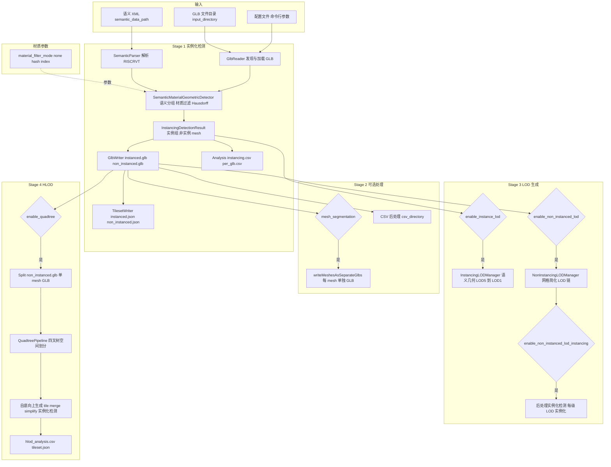
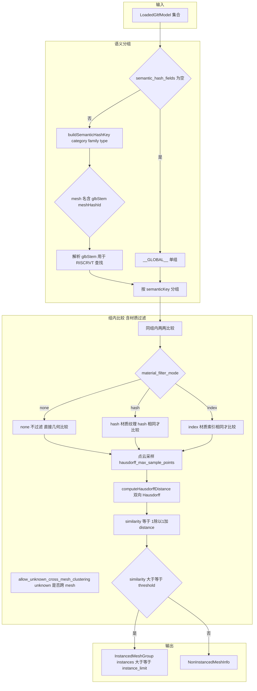
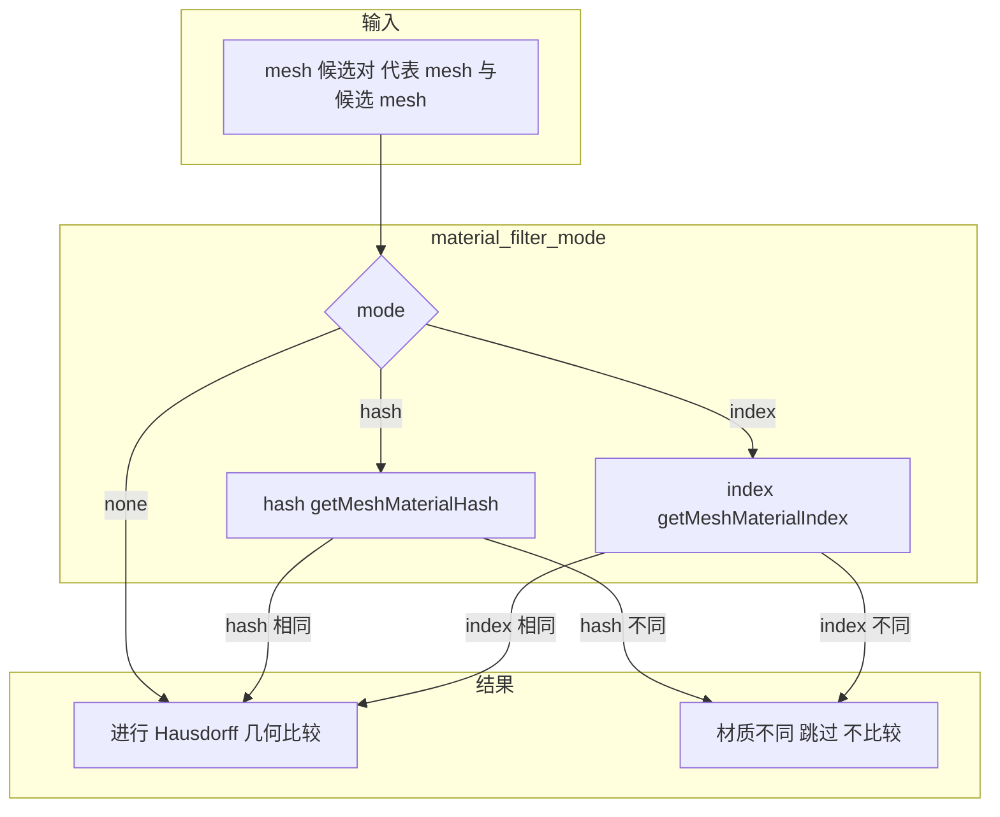
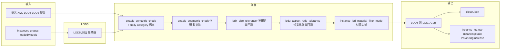
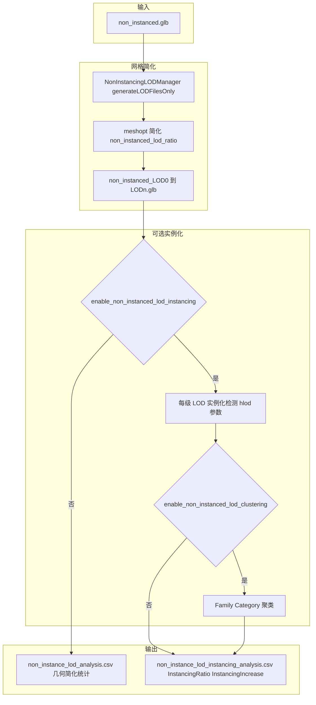
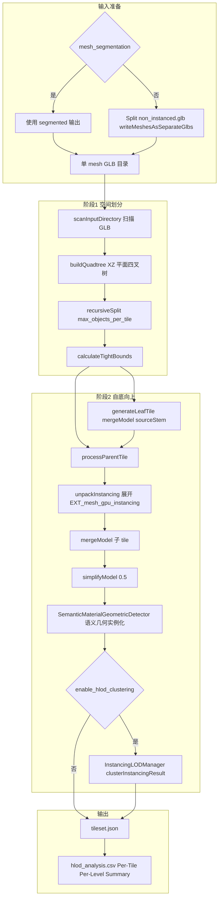
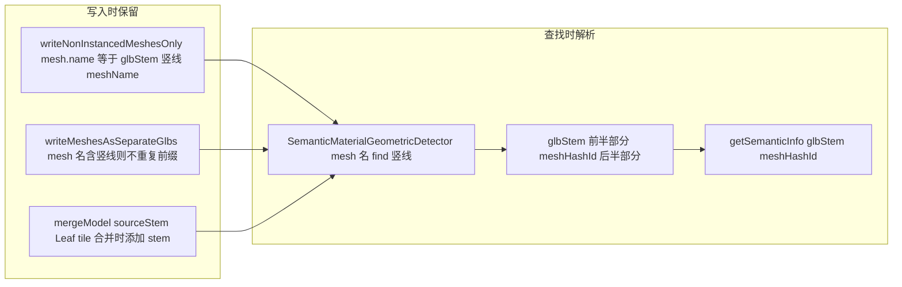
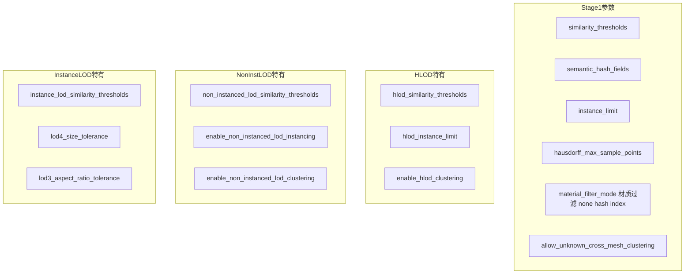

# GltfInstancingAndTilingTool 完整技术流程图

> 使用 `graph` 语法以兼容更多 Mermaid 渲染器。若预览异常，可尝试 [Mermaid Live Editor](https://mermaid.live/) 或更新 Mermaid 版本。

## 一、总体流程概览

## 二、实例化检测详细流程（SemanticMaterialGeometricDetector）

## 三、材质过滤流程（material_filter_mode）

**说明**：
- **none**：不做材质过滤，直接进行 Hausdorff 几何相似度比较
- **hash**：`getMeshMaterialHash` 计算 PBR 因子、emissiveFactor、alphaMode、doubleSided 等内容 hash，相同才比较
- **index**：`getMeshMaterialIndex` 取首个 primitive 的材质索引，相同才比较

Instance LOD 另有 `instance_lod_material_filter_mode`，可单独配置。

## 四、Instance LOD 生成流程（InstancingLODManager）

## 五、Non-instanced LOD 流程

## 六、Quadtree HLOD 流程

## 七、语义映射保留机制

## 八、输出目录结构

```mermaid
graph TB
    O[output_directory]

    subgraph dir1[01_instancing]
        I1[instanced.glb]
        I2[non_instanced.glb]
        I3[instanced.json non_instanced.json]
        I4[analysis instancing.csv]
        I5[analysis per_glb.csv]
    end

    subgraph dir2[02_instance_lod]
        L1[LOD1 到 LOD5.glb]
        L2[tileset.json]
        L3[analysis instance_lod.csv]
    end

    subgraph dir3[02_non_instance_lod]
        N1[non_instanced_LOD0 到 LODn.glb]
        N2[analysis non_instance_lod_analysis.csv]
        N3[instanced_lods 若启用实例化]
        N4[analysis non_instance_lod_instancing_analysis.csv]
    end

    subgraph dir4[03_hlod]
        H1[tiles 瓦片 GLB]
        H2[tileset.json]
        H3[hlod_analysis.csv]
    end

    O --> I1
    O --> L1
    O --> N1
    O --> H1
```

## 九、参数依赖关系

