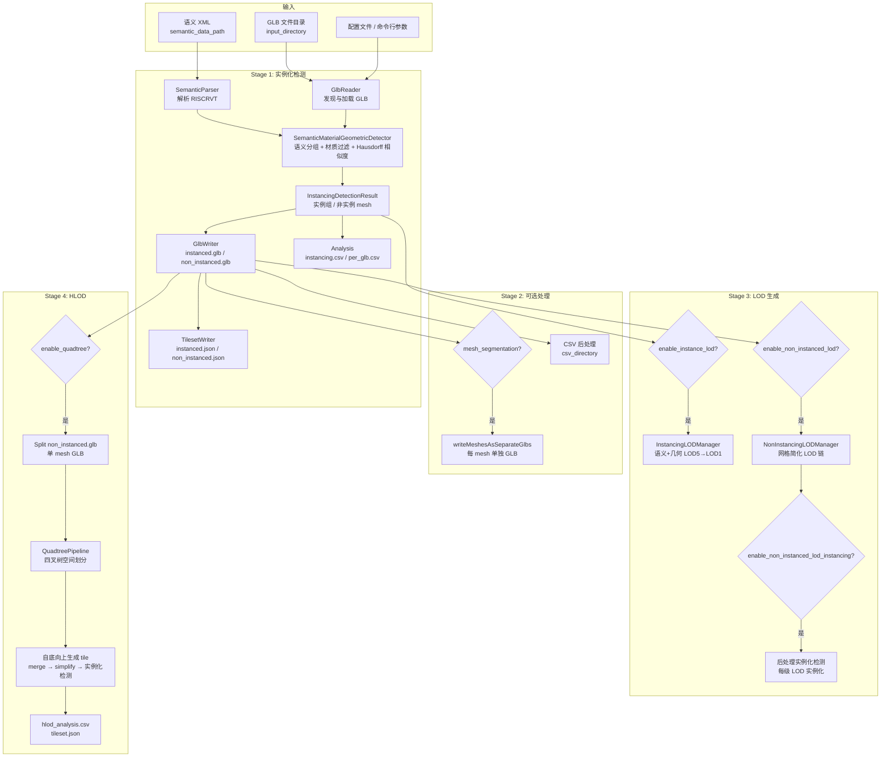
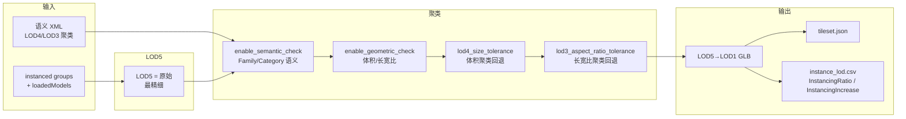
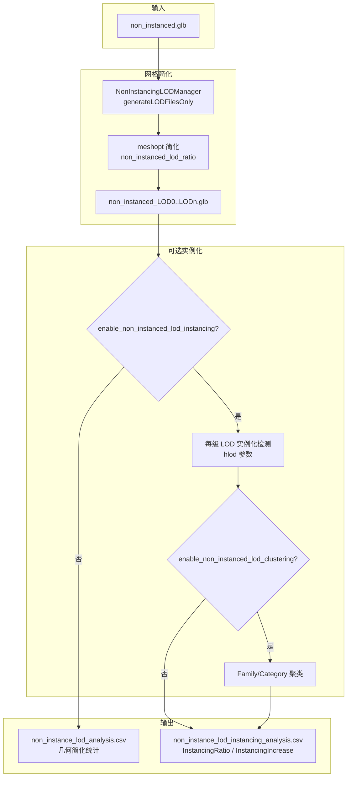
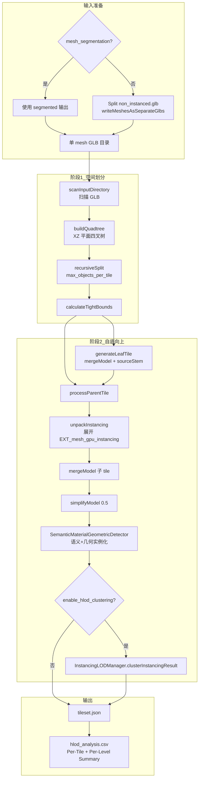
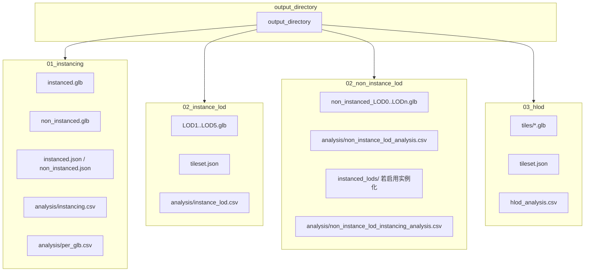
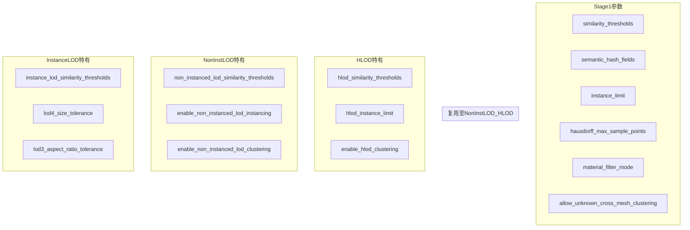

# GltfInstancingAndTilingTool 完整技术流程图

## 一、总体流程概览



## 二、实例化检测详细流程（SemanticMaterialGeometricDetector）

```mermaid
flowchart TB
    subgraph 输入
        M1[LoadedGltfModel 集合]
    end

    subgraph 语义分组
        S1[semantic_hash_fields 为空?]
        S2[__GLOBAL__ 单组]
        S3[buildSemanticHashKey<br/>category|family|type]
        S4[mesh 名含 glbStem|meshHashId?]
        S5[解析 glbStem 用于 RISCRVT 查找]
        S6[按 semanticKey 分组]
    end

    subgraph 组内比较
        G1[同组内两两比较]
        G2[material_filter_mode<br/>hash/index/none]
        G3[allow_unknown_cross_mesh_clustering<br/>unknown 是否跨 mesh]
        G4[点云采样<br/>hausdorff_max_sample_points]
        G5[computeHausdorffDistance<br/>双向 Hausdorff]
        G6[similarity = 1/(1+distance)]
        G7[similarity >= threshold?]
    end

    subgraph 输出
        O1[InstancedMeshGroup<br/>instances ≥ instance_limit]
        O2[NonInstancedMeshInfo]
    end

    M1 --> S1
    S1 -->|是| S2
    S1 -->|否| S3
    S3 --> S4
    S4 --> S5
    S5 --> S6
    S2 --> S6

    S6 --> G1
    G1 --> G2
    G2 --> G3
    G3 --> G4
    G4 --> G5
    G5 --> G6
    G6 --> G7
    G7 -->|是| O1
    G7 -->|否| O2
```

## 三、Instance LOD 生成流程（InstancingLODManager）



## 四、Non-instanced LOD 流程



## 五、Quadtree HLOD 流程



## 六、语义映射保留机制

```mermaid
flowchart LR
    subgraph 写入时保留
        W1[writeNonInstancedMeshesOnly<br/>mesh.name = glbStem|meshName]
        W2[writeMeshesAsSeparateGlbs<br/>mesh 名含 | 则不重复前缀]
        W3[mergeModel + sourceStem<br/>Leaf tile 合并时添加 stem]
    end

    subgraph 查找时解析
        R1[SemanticMaterialGeometricDetector<br/>mesh 名 find '|']
        R2[glbStem = 前半部分<br/>meshHashId = 后半部分]
        R3[getSemanticInfo glbStem meshHashId]
    end

    W1 --> R1
    W2 --> R1
    W3 --> R1
    R1 --> R2
    R2 --> R3
```

## 七、输出目录结构



## 八、参数依赖关系


