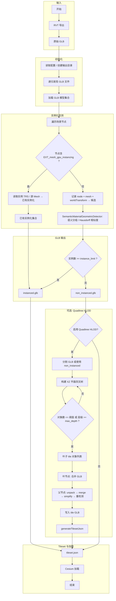

# 顾及多层次LOD层级实例特征的BIM模型轻量化方法——项目完整思路

> **流程图说明**：本文档中的流程图以 draw.io 格式存放于 `diagrams/` 目录，可用 draw.io 桌面版、VS Code Draw.io 插件或 [app.diagrams.net](https://app.diagrams.net) 打开编辑，并可导出为 PNG/SVG 用于论文插图。

---

## 核心贡献概览

本项目的两大核心贡献为：

1. **语义+材质+Hausdorff 几何相似度的多维度相似性判别模型**：从几何、语义、材质、变换等多维度建立构件等价判定体系，通过语义分组、材质过滤与 Hausdorff 几何相似度判定，实现高效实例化检测。
2. **实例特征融合的BIM构件LOD分层轻量化方法**：将几何特征、语义特征与实例变换融合于 `ExtendedMeshInfo`，按 Family→Category→Abstract 逐级聚类实现 5 级 LOD；采用分层独立优化，每层级独立执行实例化检测与实例重建，实现跨瓦片聚合与 HLOD 构建。

---

## 一、研究背景与问题定义

### 1.1 核心问题

城市级 BIM 模型（如 Revit 导出的 MEP 模型）在 Web 端渲染面临：
- **数据量大**：构件数量可达数十万级
- **重复度高**：门窗、管道、桥架等大量几何相似构件
- **流式加载需求**：需支持按视距/视锥的渐进式加载

### 1.2 研究目标

实现一条从 BIM（RVT）导出 GLB 到 3D Tiles 输出的**完整轻量化流水线**，围绕两大核心贡献展开：

**核心一**：建立**语义+材质+Hausdorff 几何相似度的多维度相似性判别模型**，支撑高效实例化检测  
**核心二**：提出**实例特征融合的BIM构件LOD分层轻量化方法**，融合 LOD 分层与分层独立优化、实例重建，实现 5 级 LOD 与 HLOD

**具体目标**：

| 目标 | 内容 |
|------|------|
| 实例化检测 | 基于多维度相似性判别，识别几何等价且语义相容的构件，合并为 `EXT_mesh_gpu_instancing` |
| 多级 LOD | 基于 ExtendedMeshInfo 实例特征融合，实现语义+几何驱动的 5 级 LOD（LOD5→LOD1） |
| HLOD 构建 | XZ 平面四叉树空间划分 + 自底向上分层独立优化，每层级重新执行实例化检测与实例重建 |
| 实验验证 | 6 类对比实验（实例化策略、LOD 策略、HLOD 参数、端到端、非均匀缩放、跨 GLB）支撑方法有效性 |

### 1.3 研究意义

#### 理论扩展

将 Hausdorff 距离等几何相似度度量引入 BIM 实例化检测，提出**语义+材质+Hausdorff 几何相似度的多维度相似性判别模型**。通过 `SemanticMaterialGeometricDetector` 实现：先按语义（category、family、type）分组降规模，再结合材质过滤（`material_filter_mode`）与 **Hausdorff 相似度**（`similarity_threshold`）判定几何等价，解决了旋转、平移、均匀/非均匀缩放下的构件实例识别问题，突破了传统单一依赖语义 ID 或严格几何匹配的局限性。

#### 技术革新

设计了一种融合**实例特征分层聚类**与**基于 XZ 平面四叉树的空间层次 HLOD** 的混合数据组织方案。该方案将几何特征、语义特征与实例变换融合于 `ExtendedMeshInfo`，按 Family→Category→Abstract 逐级聚类；HLOD 采用分层独立优化与实例重建，每层级独立执行实例化检测，兼顾空间划分的层次性与渲染的空间相干性，提升了大规模 BIM 的渲染效率。

#### 工程应用

构建了一套从 GLB 到 3D Tiles 的**层次化瓦片组织**流水线，其输出支持 Cesium 等客户端的按视距/视锥流式加载。在保证视觉保真度的前提下，通过实例化与 LOD 显著降低了 Draw Calls 与几何冗余，对推动 BIM 数据在 Web 端、移动端及 VR/AR 设备上的流畅加载、赋能智慧城市精细化管理具有重要的实用价值。

---

## 二、技术路线总览

### 2.1 技术路线流程

本工具以「读入 → 分析 → 重组 → 输出」为主线，结合语义与几何特征进行分层组织，最终生成可用于 Cesium 等客户端流式加载的 GLB/tileset。

**主流程**：
1. **配置与初始化**：读取配置文件或命令行参数，创建输出目录
2. **输入发现与加载**：递归扫描 GLB 文件，通过 GlbReader 加载为 `LoadedGltfModel` 集合
3. **实例化检测**：SemanticMaterialGeometricDetector 按语义分组，结合 Hausdorff 几何相似度判定，进行 mesh 级聚类
4. **GLB 重组与输出**：GlbWriter 生成 `instanced.glb`、`non_instanced.glb`（输出于 `01_instancing/`）
5. **Tileset 生成**：TilesetWriter 基于包围盒与几何误差生成 `tileset.json`

**可选流程**：
- **非实例化 LOD**：NonInstancingLODManager 对非实例化 GLB 进行网格简化
- **网格分片**：将 GLB 拆分为单 mesh GLB，供 Quadtree 使用
- **实例化 LOD**：SemanticParser + InstancingLODManager 生成 5 级语义 LOD
- **Quadtree HLOD**：QuadtreePipeline 构建四叉树，自底向上生成瓦片与 tileset

### 2.2 技术路线流程图



**备选流程图（draw.io）**：可用 draw.io 打开 [diagrams/技术路线.drawio](diagrams/技术路线.drawio) 查看与编辑；Mermaid 图可在支持 Mermaid 的 Markdown 预览中渲染。

---

## 三、核心方法详解

### 核心一：语义+材质+Hausdorff 几何相似度的多维度相似性判别模型

BIM 构件的实例化等价判定需综合考虑**几何、语义、材质、变换**等多维度信息。本项目建立了一套**语义+材质+Hausdorff 几何相似度的多维度相似性判别模型**，通过 `SemanticMaterialGeometricDetector` 实现：先按语义分组降规模，再结合材质过滤与 Hausdorff 几何相似度判定，实现高效、可配置的实例化检测。

#### 3.1.0 多维度信息定义与融合框架

**维度划分**：

| 维度 | 信息内容 | 数据来源 | 代码对应 |
|------|----------|----------|----------|
| **几何维度** | 顶点位置、点云采样、Hausdorff 距离 | glTF MeshPrimitive | `computeMeshSimilarity`、`hausdorff_similarity.cpp` |
| **材质维度** | material、material_filter_mode | glTF MeshPrimitive | `material_filter_mode`（none/hash/index） |
| **语义维度** | Category、Family、Type | RISCRVT XML | `SemanticParser::getSemanticInfo`、`buildSemanticHashKey` |
| **变换维度** | 平移、旋转、缩放 | Node 变换 | `MeshInstanceInfo`、`TransformComponents` |

**融合策略**：先按 `semanticHashFields`（category、family、type）分组；组内按 `material_filter_mode` 过滤后，用 Hausdorff 相似度（`similarity_threshold`）判定几何等价；变换通过 `MeshInstanceInfo` 记录实例位置。

#### 3.1 实例化判定方法（对应论文第三章）

**形式化定义**（见 [论文_第三章第四章.md](论文_第三章第四章.md)）：
- **几何等价**：Hausdorff 相似度 ≥ similarity_threshold（0~1）
- **语义等价**：Category、Family、Type 一致（按 semanticHashFields）
- **变换等价**：支持均匀/非均匀缩放

**多维度判别流程**：

```
语义维度(Category,Family,Type) ─→ 语义分组 ─┐
                                            ├─→ 组内 Hausdorff 相似度判定 ─→ 实例组聚类
材质维度(material_filter_mode) ─→ 材质过滤 ─┘
几何维度(点云采样) ─→ computeMeshSimilarity ─┘
```

**双层筛选流程**：

| 层级 | 方法 | 涉及维度 | 复杂度 |
|------|------|----------|--------|
| 语义预筛选 | 按 C/F/T 分组 | 语义 | O(n log n) |
| 材质过滤 | material_filter_mode（可选） | 材质 | O(n_i) |
| Hausdorff 精化 | 点云采样 + Hausdorff 距离 → 相似度 | 几何 | O(k·m²) |

**实现对应**：[semantic_material_geometric_detector.cpp](src/semantic_material_geometric_detector.cpp) 中的 `traverseNode`、`buildSemanticHashKey`、`computeMeshSimilarity`；[hausdorff_similarity.cpp](src/hausdorff_similarity.cpp) 中的 `computeHausdorffDistance`、`hausdorffDistanceToSimilarity`；[semantic_parser.h](src/semantic_parser.h) 中的 `SemanticInfo`（category、family、type）。

---

### 3.1.1 Hausdorff 几何相似度在实例化判定中的作用（完整说明）

Hausdorff 几何相似度是实例化检测的核心技术手段，其作用是将**几何形状**转化为**相似度分数**（0~1），用于判定两个 Mesh 是否几何等价，从而支持语义分组内的实例聚类。

#### Hausdorff 的作用

**1. 几何等价判定**

- 对 Mesh 顶点进行点云采样（`hausdorffMaxSamplePoints` 限制规模）
- 计算双向 Hausdorff 距离，转换为相似度：`similarity = 1 / (1 + distance)`
- 相似度 ≥ `similarity_threshold` 的 Mesh 归为同一实例组

**2. 支持多级阈值**

- `similarity_thresholds`：逗号分隔，如 `0.95,0.90,0.85,0.80,0.75`，对应不同 LOD 层级
- 主流程使用首值（如 0.95），HLOD 使用 `hlodSimilarityThreshold`（如 0.70）

**3. 材质过滤（可选）**

- `material_filter_mode = "none"`：不按材质过滤，仅几何+语义
- `material_filter_mode = "hash"`：材质+纹理 hash 相同才比较
- `material_filter_mode = "index"`：材质索引相同才比较

#### Hausdorff 计算流程

**流程图**：详见 [diagrams/几何相似度判定流程.drawio](diagrams/几何相似度判定流程.drawio)。

1. **语义分组**：`buildSemanticHashKey` 按 category、family、type 生成键，相同键的 Mesh 进入同一组
2. **点云提取**：从 Mesh 顶点采样点云，`hausdorffMaxSamplePoints` 限制点数（0 表示不采样，退化为其他判定）
3. **Hausdorff 距离**：`computeHausdorffDistance` 计算双向 Hausdorff 距离
4. **相似度转换**：`hausdorffDistanceToSimilarity` 将距离转为 [0,1] 相似度
5. **聚类**：相似度 ≥ threshold 的 Mesh 合并为实例组

**伪代码**：

```cpp
// semantic_material_geometric_detector.cpp
for (auto& [semanticKey, candidates] : semanticGroups) {
    for (meshCur : candidates) {
        for (meshRep : representatives) {
            double sim = computeMeshSimilarity(modelCur, meshCur, modelRep, meshRep, hausdorffMaxSamplePoints);
            if (sim >= similarityThreshold) {
                // 加入同一实例组
            }
        }
    }
}
```

#### 实现与配置

- **similarity_thresholds**：主流程相似度阈值，逗号分隔
- **hausdorff_max_sample_points**：点云采样上限，0 禁用采样
- **material_filter_mode**：none / hash / index
- **allow_unknown_cross_mesh_clustering**：语义为 unknown 时是否允许跨 mesh 聚类

---

### 核心二：实例特征融合的BIM构件LOD分层轻量化方法

LOD 分层轻量化的核心在于将**几何特征、语义特征与实例变换**融合于统一数据结构，按层级逐步放宽相似性约束，实现从精细到概览的 5 级 LOD 链；同时采用**分层独立优化与实例重建**策略，在 HLOD 各层级独立执行实例化检测，不继承子层级实例标识，通过“解包→合并→简化→重检测”实现跨瓦片实例聚合。

#### 3.2.0 实例特征融合数据结构

**ExtendedMeshInfo**（[instancingLOD_manager.h](src/instancingLOD_manager.h) 第 17–37 行）是实例特征融合的载体：

```cpp
struct ExtendedMeshInfo {
    // 几何特征 (Geometric Features)
    BoundingBox aabb;
    double volume;            // AABB 体积
    double diagonal;          // AABB 对角线长度
    int vertexCount;          // 顶点数量

    // 语义特征 (Semantic Features)
    SemanticInfo semantic;    // category, family, type

    // 实例特征 (Instance Features)
    std::vector<MeshInstanceInfo> instances;  // 变换组件 T/R/S
};
```

**融合流程**：`initializeLOD5` 从 `InstancingDetectionResult` 与 `SemanticParser` 中提取几何、语义与实例，填充 `ExtendedMeshInfo`；各 LOD 层级在此基础上按不同融合策略聚类。

#### 3.2 5 级 LOD 分层逻辑（语义+几何联合驱动）

**5 级 LOD 分层逻辑**（[instancingLOD_manager.cpp](src/instancingLOD_manager.cpp)）：

| 层级 | 聚类依据 | 融合的实例特征 | 代表体选择 | 代码函数 |
|------|----------|----------------|------------|----------|
| LOD5 | 原始实例组 | 几何+语义+实例 | 原始几何 | `initializeLOD5` |
| LOD4 | Family + 体积容差 (5%) | 语义(Family) + 几何(volume) | VolumeMean | `buildLOD4` |
| LOD3 | Category + 长宽比容差 (20%) | 语义(Category) + 几何(aspectRatio) | MinVertexCount | `buildLOD3` |
| LOD2 | 抽象类别映射 | 语义(Abstract) | 极简模型 | `buildLOD2` |
| LOD1 | 全局 AABB | 实例变换融合为 Cube 代理 | Cube | `buildLOD1` |

**LOD4 实例特征融合**（`buildLOD4` 第 124–200 行）：

- 按 `semantic.family` 分组
- 几何子聚类：`volDiff = |volume_j - volume_i| / volume_i < lod4_sizeTolerance`（默认 5%）
- 实例合并：`newNode.instances.insert(..., member->instances.begin(), member->instances.end())`
- 代表体：`findRepresentative(cluster, 0)`（VolumeMean）

**LOD3 实例特征融合**（`buildLOD3` 第 206–271 行）：

- 按 `semantic.category` 分组
- 几何子聚类：`|aspectRatio_j - aspectRatio_i| < lod3_aspectRatioTolerance`（默认 20%）
- 代表体：`findRepresentative(cluster, 1)`（MinVertexCount）

**LOD1 实例变换融合**（`buildLOD1` 第 285–324 行）：

- 将所有 LOD2 实例的变换映射到 Unit Cube：`localFix = translate(center) * scale(size)`，再与原始变换组合
- 实现用单一 Cube 几何 + 多实例变换表示全场景

**代表体选择策略**：`findRepresentative`（第 341–374 行）支持 strategy=0（VolumeMean）、strategy=1（MinVertexCount）。

---

### 3.3 HLOD 构建方法（对应论文第四章）

HLOD 在空间层级上延续**实例特征融合**思想：每层级通过 `SemanticMaterialGeometricDetector` 对简化后的几何重新执行**多维度相似性判别**（语义分组 + Hausdorff 相似度），将跨子瓦片的构件重新聚类为实例组，实现实例特征的层级间重建与融合。

**自底向上流程**（[QuadtreePipeline.cpp](src/QuadtreePipeline.cpp)）：

1. **空间划分**：XZ 平面四叉树，Y 为高度轴；终止条件：深度/对象数/面积
2. **叶节点**：直接合并落入该瓦片的原始 GLB，不做简化
3. **父节点**：`unpackInstancing` → `mergeModel` → `simplifyMergedModel(0.5)` → `detectInstancingInMemory` → 写入 GLB

**分层独立优化**：每层级**独立**调用实例化检测（即多维度相似性判别），不继承子层级实例组标识；实例化信息通过**几何相似性**在简化后重新识别并融合。

---

### 3.3.1 HLOD 建立流程（详细说明）

**流程图**：详见 [diagrams/HLOD建立流程.drawio](diagrams/HLOD建立流程.drawio)。

HLOD（Hierarchical Level of Detail）的建立由 [QuadtreePipeline](src/QuadtreePipeline.cpp) 完成，采用**自底向上**策略：先构建四叉树空间结构，再从叶子节点逐层向上生成瓦片内容。

#### 阶段一：空间层次划分（四叉树构建）

**1. 输入扫描**（`scanInputDirectory`）

- 递归遍历输入目录，发现所有 `.glb` / `.gltf` 文件
- 对每个文件加载为 `CesiumGltf::Model`，计算其 AABB（`computeAABB`）
- 提取中心点 `center`、尺寸 `dimensions`、顶点数 `vertexCount`，构建 `SceneObject` 元数据
- 所有 `SceneObject` 存入 `_sceneObjects`

**2. 四叉树分割**（`buildQuadtree` + `recursiveSplit`）

- **平面选择**：在 XZ 平面进行四叉树分割，Y 轴（高度）保持完整，适应建筑/BIM 的楼层结构
- **全局范围**：根据所有对象的 AABB 计算 `globalMin`、`globalMax`，取 X、Z 方向较大边作为根节点边长
- **递归分割规则**：
  - 终止条件：`objects.size() <= quadtreeMaxObjectsPerTile` 或 `level >= quadtreeMaxDepth`
  - 分割点：`midX = (minBound.x + maxBound.x) / 2`，`midZ = (minBound.z + maxBound.z) / 2`
  - 四个子节点：BL、BR、TL、TR，根据对象中心点 `(center.x, center.z)` 落入区间分配
- **紧致包围盒**：`calculateTightBounds` 自底向上合并子节点实际内容范围，用于 tileset 的 `boundingVolume`

#### 阶段二：自底向上内容生成

**1. 处理顺序**

- 按层级从深到浅排序（`level` 降序）
- 同一层级内依次处理每个节点

**2. 叶节点内容生成**（`generateLeafTile`）

- **收集对象**：该叶节点空间范围内的所有 `SceneObject`（即对应 GLB 文件）
- **直接合并**：调用 `mergeModel` 将所有 GLB 合并为单一 `CesiumGltf::Model`
- **不做简化**：保留原始几何，不调用网格简化
- **输出**：写入 `T{level}_{x}_{y}.glb`，如 `T4_0_0.glb`

**3. 父节点内容生成**（`processParentTile` → `createParentTileContent`）

| 步骤 | 操作 | 说明 |
|------|------|------|
| ① | `unpackInstancing` | 将子节点 GLB 中的 `EXT_mesh_gpu_instancing` 展开为显式节点，以便后续简化 |
| ② | `mergeModel` | 将所有子节点 GLB 合并为单一模型 |
| ③ | `simplifyMergedModel(0.5)` | 调用 meshoptimizer 简化，目标面数比例为 50% |
| ④ | `SemanticMaterialGeometricDetector` | 对简化后的模型**独立**执行实例化检测（Hausdorff 相似度），不继承子层级实例组 |

- **输出**：将检测结果写入 `T{level}_{x}_{y}.glb`，其中实例化部分使用 `EXT_mesh_gpu_instancing`

#### 阶段三：Tileset 生成

- `generateTilesetJson`：递归遍历四叉树，为每个节点生成 `boundingVolume` 和 `content.uri`
- 几何误差：`geometricError` 按层级配置（`LodLevelConfig` 中的 `geometricErrorFactor`）
- 输出 `tileset.json`，符合 3D Tiles 1.1 规范
- `writeAnalysisReport`：生成 `hlod_analysis.csv` 等分析报告

#### 分层独立优化的意义

- **实例重建**：父层级不依赖子层级的实例组 ID，仅基于简化后的几何重新识别实例
- **跨瓦片聚合**：来自不同子瓦片的相同构件在合并后处于同一检测空间，可自然被识别为同一实例组
- **自适应精度**：简化导致的微小几何变化可通过容差判定适应，无需维护跨层级的标识映射

---

### 3.4 非实例化 LOD（网格简化）

[NonInstancingLOD_manager](src/NonInstancingLOD_manager.cpp)：基于 meshoptimizer 的简化链，生成多级 LOD 文件；可选对 LOD 再做实例化检测。简化参数包括 `targetRatio`、`minSimplifyIndexCount` 等。

---

## 四、数据流与关键模块

| 模块 | 职责 | 关键输出 |
|------|------|----------|
| GlbReader | 发现/加载 GLB、解析 tileset、SHA256 去重 | LoadedGltfModel[] |
| SemanticMaterialGeometricDetector | 语义分组、Hausdorff 相似度、聚类 | InstancingDetectionResult |
| GlbWriter | 实例化/非实例化/LOD GLB 写入 | instanced.glb、non_instanced.glb 等 |
| TilesetWriter | tileset.json、层级 tileset、wrapper | tileset_*.json |
| InstancingLODManager | 5 级语义 LOD | LOD1..5.glb |
| NonInstancingLODManager | 网格简化 LOD | non_instanced_lod_*.glb |
| QuadtreePipeline | 四叉树 HLOD 自底向上构建 | quadtree_output/ |
| SemanticParser | RISCRVT XML 解析 | Hash→Category/Family/Type |

---

## 五、实验框架设计

**6 类实验**（[experiment_design.md](experiment_design.md)）：

| 实验 | 目的 | 变量/对比 |
|------|------|-----------|
| 实验1 | 实例化策略 | Strict / Moderate / Lenient 相似度阈值（如 0.99/0.95/0.90） |
| 实验2 | LOD 策略 | 实例化 LOD vs 非实例化 LOD |
| 实验3 | HLOD 参数 | MaxDepth、MaxObjects、GeometricError |
| 实验4 | 端到端性能 | 原始 / 仅实例化 / +LOD / +HLOD / 完整 |
| 实验5 | 非均匀缩放 | allowNonUniformScale 开/关 |
| 实验6 | 跨 GLB HLOD | Merged vs Separate 构建策略 |

**输出文件**：`01_instancing/analysis/instancing.csv`、`02_instance_lod/analysis/instance_lod.csv`、`03_hlod/hlod_analysis.csv`、`cross_glb_hlod_analysis.csv` 等，由 [experiment_framework](src/experiment_framework.cpp) 与 [experiment6_runner](src/experiment6_runner.cpp) 生成。

---

## 六、配置体系

[ToolConfiguration.h](src/ToolConfiguration.h) 中的关键参数：

- **实例化**：`similarity_thresholds`、`semantic_hash_fields`、`hausdorff_max_sample_points`、`material_filter_mode`、`instanceLimit`
- **LOD**：`enableInstanceLodGeneration`、`lodLevelCount`、`targetScreenSSE`、`semanticDataPath`
- **HLOD**：`hlodSimilarityThreshold`、`hlodInstanceLimit`（可独立于 Stage1）
- **四叉树**：`quadtreeMaxDepth`、`quadtreeMaxObjectsPerTile`

---

## 七、论文结构建议

```
第一章 绪论
  1.1 研究背景与意义
  1.2 国内外研究现状
  1.3 研究内容与论文结构

第二章 相关技术与理论基础
  2.1 BIM 与 glTF/GLB 格式
  2.2 3D Tiles 与 HLOD
  2.3 GPU 实例化与 LOD 技术

第三章 语义+材质+Hausdorff 几何相似度的多维度相似性判别模型（核心一）
  3.1 多维度信息定义与融合框架
  3.2 语义分组与 Hausdorff 几何相似度判定
  3.3 材质过滤与变换等价
  （对应 semantic_material_geometric_detector + semantic_parser + hausdorff_similarity）

第四章 实例特征融合的BIM构件LOD分层轻量化方法（核心二）
  4.1 ExtendedMeshInfo 与实例特征融合
  4.2 5 级语义+几何联合 LOD 分层与分层独立优化、实例重建
  4.3 顾及实例特征的 HLOD 构建
  （对应 instancingLOD_manager + QuadtreePipeline）

第五章 实验与评估
  （对应 experiment_design.md 六类实验 + 实验框架输出）

第六章 总结与展望
```

---

## 八、关键创新点归纳

**核心贡献一：语义+材质+Hausdorff 几何相似度的多维度相似性判别模型**

1. **语义+材质+几何融合**：建立几何、材质、语义、变换四维度的等价判定体系，通过 `SemanticMaterialGeometricDetector` 实现语义分组、材质过滤与 Hausdorff 几何相似度判定
2. **语义-几何双层筛选**：先语义分组降规模，再 Hausdorff 相似度精化，兼顾效率与召回率
3. **Hausdorff 相似度度量**：点云采样 + 双向 Hausdorff 距离，转换为 [0,1] 相似度，支持近似几何的实例识别

**核心贡献二：实例特征融合的BIM构件LOD分层轻量化方法**

4. **实例特征融合的 LOD 分层与分层独立优化、实例重建**：将几何、语义、实例变换融合于 `ExtendedMeshInfo`，按 Family→Category→Abstract 逐级聚类实现 5 级 LOD；在 HLOD 中采用分层独立优化，每层级独立执行实例化检测与实例重建，通过“解包→合并→简化→重检测”实现跨瓦片聚合，不依赖子层级实例标识

**支撑性贡献**

5. **系统化实验框架**：6 类实验覆盖策略、参数、端到端与跨 GLB 场景，支撑论文论证
